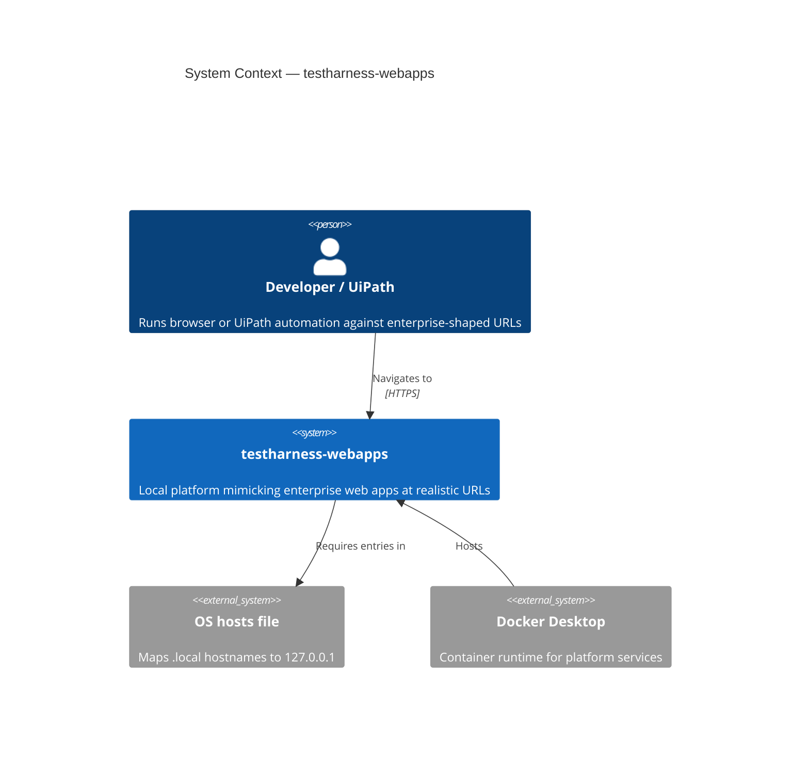
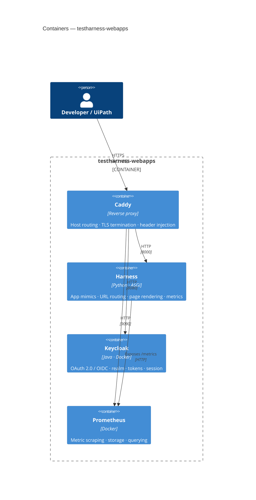
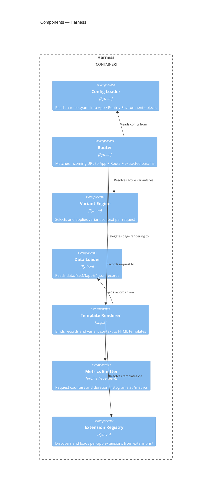
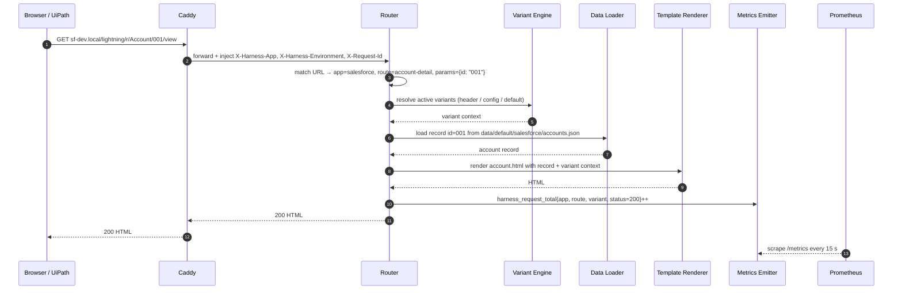
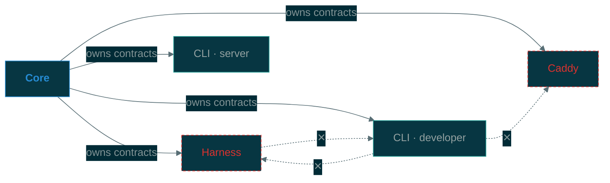

# Architecture

## 1. System context

Who uses the system and what external infrastructure it depends on.



---

## 2. Containers

The running processes and the protocols between them.



---

## 3. Harness components

Internal building blocks of the Harness process.



---

## 4. Request flow

### Happy path



### Trust boundary

Harness **only trusts** `X-Harness-*` headers that arrive from Caddy. Any client-supplied values for these headers are overwritten by Caddy before forwarding. Port `8000` is internal to the Docker network and not reachable from the host directly — all external traffic enters through Caddy on `80`/`443`.

**Verifiable control:** `harness validate --security` (or the CI smoke-test target) must assert that a direct HTTP request to `localhost:8000` with a spoofed `X-Harness-App` header is either refused or returns the same result as a request without that header — confirming Caddy's overwrite is the only trusted source. This check runs as part of `harness run` startup validation.

### Error flows

| Condition | HTTP status | Metric label | Behaviour |
|-----------|-------------|--------------|-----------|
| No route matches host + path | `404` | `status=404` | Router returns a plain 404 page; no template render attempted |
| Route matched, record not found in data | `422` | `status=422` | Renderer returns a stub page with placeholder fields |
| Template render error | `500` | `status=500` | Harness returns an error page; exception logged with `request_id` |
| Incompatible variants requested | `409` | `status=409` | Variant Engine rejects before render; no data load |
| Extension load failure at startup | — | — | Harness refuses to start; error written to stdout |

All non-200 responses still increment `harness_request_total` with the appropriate `status` label so error rates are queryable in Prometheus.

---

## 5. Package structure

```text
testharness-webapps/
  src/
    core/         App · Route · Environment · PatternType
                  Config Loader · URL Resolver · URL Matcher
    harness/      ASGI app · Router · Variant Engine
                  Data Loader · Template Renderer · Metrics Emitter
                  Server CLI entry point
    cli/          Developer CLI
                  init · validate · generate-caddy · generate-prometheus
                  seed · idp export/import · run · stop

  extensions/     Per-app Python hooks and extension metadata
  templates/      Per-app Jinja2 templates  (templates/{app}/*.html)
  data/
    default/      Static seed=42 dataset; IDs match fixture params (committed)
    dynamic/      Generated at runtime (gitignored)
  config/
    harness.yaml
  infra/
    caddy/
    keycloak/     harness-realm.json
    prometheus/   prometheus.yml
    docker-compose.yml
  scripts/        Spike and generation scripts
  tests/
    fixtures/     YAML resolve · match · profile cases per app
```

---

## 6. Dependency rules

Core is the only shared foundation. Harness, CLI, and Caddy depend on Core. No service imports code from another service; runtime dependencies between services are via explicit network contracts only.



---

## 7. Extension model

Adding a new enterprise application requires no changes to Core or Harness:

```text
config/harness.yaml          ← add app entry
extensions/{app}/            ← optional Python hooks
templates/{app}/*.html       ← Jinja2 templates
data/default/{app}/*.json    ← seed data (committed)
```

---

## 8. Quality attributes

| Attribute | Mechanism |
|-----------|-----------|
| **Extensibility** | Extension registry; new app needs no core changes |
| **Reproducibility** | Seeded Faker (`seed=42`); `data/default/` committed; deterministic variants |
| **Isolation** | Services communicate through explicit interfaces only; no cross-service imports |
| **Local-first** | Docker Compose + OS hosts file; no internet dependency at runtime |
| **Observability** | Prometheus metrics at `/metrics` (labels: app, route, variant, status, duration); structured logs per request with `request_id`, app, route, variant, status, duration\_ms |

---

## 9. Ports

| Service    | Port     |
|------------|----------|
| Harness    | 8000     |
| Keycloak   | 8080     |
| Prometheus | 9090     |
| Caddy      | 80 / 443 |

---

## 10. Architecture decisions

Key decisions are recorded as ADRs in [`docs/adr/`](adr/):

| ID | Decision |
|----|----------|
| [ADR-001](adr/001-single-harness-yaml.md) | Single `harness.yaml` over per-service config files |
| [ADR-002](adr/002-keycloak.md) | Keycloak over a custom IdP implementation |
| [ADR-003](adr/003-extension-model.md) | Additive extension model — no core changes per app |
| [ADR-004](adr/004-uv-workspace.md) | uv workspace with parent venv |
| [ADR-005](adr/005-response-contracts.md) | Response and metric semantics are stable contracts |
