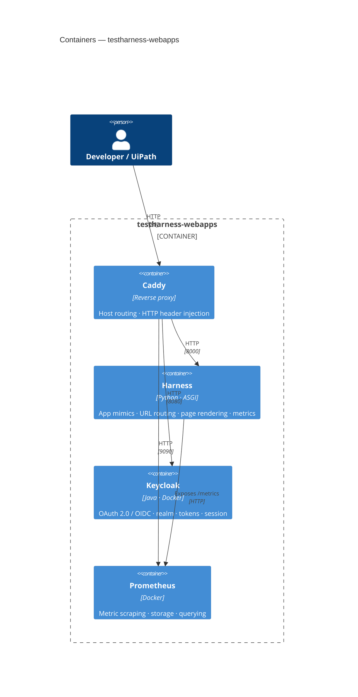
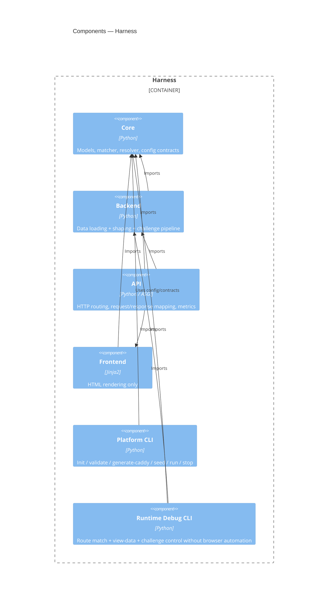
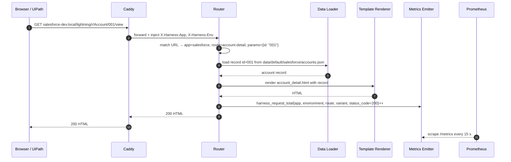
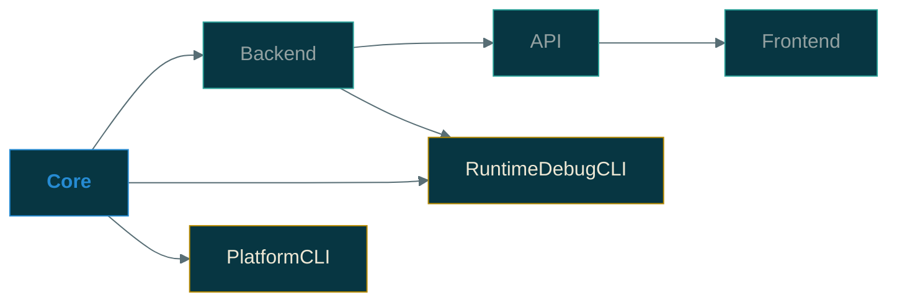

# Architecture

## 1. System context

Who uses the system and what external infrastructure it depends on.


## 2. Containers

The running processes and the protocols between them.



## 3. Harness components

Internal building blocks of the Harness process.



## 4. Request flow

### Happy path



### Hostname scheme

Every app has two environments. Hostnames follow the pattern `{app-id}-{env}.local`:

| App | dev / cloud | prod / self-hosted |
|-----|-------------|-------------------|
| salesforce | `salesforce-dev.local` | `salesforce-prod.local` |
| dynamics | `dynamics-dev.local` | `dynamics-prod.local` |
| jira | `jira-cloud.local` | `jira-onprem.local` |
| confluence | `confluence-cloud.local` | `confluence-onprem.local` |
| … | `{app-id}-cloud.local` | `{app-id}-onprem.local` |

All hostnames resolve to `127.0.0.1` via the OS hosts file (`infra/hosts.txt`).

### Trust boundary

Harness **only trusts** `X-Harness-*` headers that arrive from Caddy.
Any client-supplied values for these headers are overwritten by Caddy before
forwarding. Port `8000` is internal to the Docker network and not reachable
from the host directly. All external traffic enters through Caddy on port `80`.

### Error flows

| Condition | HTTP status | Behaviour |
|-----------|-------------|-----------|
| No route matches host + path | `404` | Error page rendered; no template render attempted |
| Route matched, record not found in data | `404` | `RecordNotFound` raised in backend; error page rendered with `support_code` |
| Template render error | `500` | Harness returns an error page |
| Fault injected via challenge pipeline | varies | `_FAULT_TO_STATUS` maps fault kind to HTTP status; error page rendered |

All responses increment `harness_request_total` with the appropriate `status_code` label.

## 5. Package structure

```text
testharness-webapps/
  src/
    core/               models · config · resolver · matcher · sample_params
                        RouteContext · ViewData · Challenge/Fault types
    backend/            data_loader · shaper · pipeline
                        (no HTTP concerns)
    api/                app · router · metrics
                        (HTTP only)
    frontend/           renderer
                        (HTML only)
    platform_cli/       outer control-plane CLI (harness)
    runtime_debug_cli/  inner debug CLI (harness-debug)
                        (no API/frontend dependency)

  templates/
    shared/       list.html · detail.html  (generic; used by any app)
    {app}/        Per-app templates (home.html, plus app-specific overrides)
  data/
    default/      Static seed=42 dataset; IDs match fixture params (committed)
  harness.yaml    Single config file at repo root
  infra/
    caddy/
    keycloak/     harness-realm.json
    prometheus/   prometheus.yml
    docker-compose.yml
  scripts/        Generation scripts (generate_fixtures.py, generate_data.py)
  tests/
    fixtures/     YAML resolve · match · profile cases per app
```

## 6. Route structure per app

Every app defines three tiers of routes in `harness.yaml`:

| Tier | Example path | Template |
|------|-------------|----------|
| Home | `/lightning/page/home` | `{app}/home.html` |
| List | `/lightning/r/Account/list/view` | `shared/list.html` |
| Detail | `/lightning/r/Account/{id}/view` | `{app}/account_detail.html` or `shared/detail.html` |

Routes are evaluated in order. More-specific routes
(more required query params, or more literal path segments) appear first.
Pattern types:

- `path` — matched by URL path only; optional query params collected if present
- `query` — matched only when all listed `query_params` are present in the request

## 7. Dataset selection

The data directory to load is resolved in priority order:

1. `HARNESS_DATA_SET` environment variable (highest — Docker override)
2. `data.set` key in `harness.yaml`
3. `"default"` (fallback)

## 8. Adding a new app

```text
harness.yaml               ← add app entry (id, vendor, product, environments, nav, routes)
templates/{app}/home.html  ← home template
templates/{app}/*.html     ← additional per-app templates (optional;
                              shared/ templates work for list/detail)
data/default/{app}/*.json  ← seed data (committed); generate with scripts/generate_data.py
```

## 9. Dependency rules

Core is the shared foundation. Import direction is strict:

- `core <- backend <- api -> frontend`
- `core <- backend <- runtime_debug_cli`
- `platform_cli` is control-plane only and does not own runtime serving behavior.
- No `frontend -> api` imports.
- No `runtime_debug_cli -> api` or `runtime_debug_cli -> frontend` imports.



## 10. Quality attributes

| Attribute | Mechanism |
|-----------|-----------|
| **Extensibility** | New app needs no core changes:<br/>add entry to `harness.yaml`, templates, and seed data |
| **Reproducibility** | Seeded Faker (`seed=42`); `data/default/` committed;<br/>deterministic fixture generation |
| **Isolation** | Services communicate through explicit interfaces only; no cross-service imports |
| **Local-first** | Docker Compose + OS hosts file; no internet dependency at runtime |
| **Observability** | Prometheus metrics at `/metrics`<br/>(labels: `app`, `environment`, `route`, `variant`, `status_code`) |

## 11. Ports

| Service    | Port     |
|------------|----------|
| Harness    | 8000     |
| Keycloak   | 8080     |
| Prometheus | 9090     |
| Caddy      | 80       |

## 12. Architecture decisions

Key decisions are recorded as ADRs in [`docs/adr/`](adr/):

| ID | Decision |
|----|----------|
| [ADR-001](adr/001-single-harness-yaml.md) | Single `harness.yaml` over per-service config files |
| [ADR-002](adr/002-keycloak.md) | Keycloak over a custom IdP implementation |
| [ADR-003](adr/003-extension-model.md) | Additive extension model — no core changes per app |
| [ADR-004](adr/004-uv-workspace.md) | uv workspace with parent venv |
| [ADR-005](adr/005-response-contracts.md) | Response and metric semantics are stable contracts |
