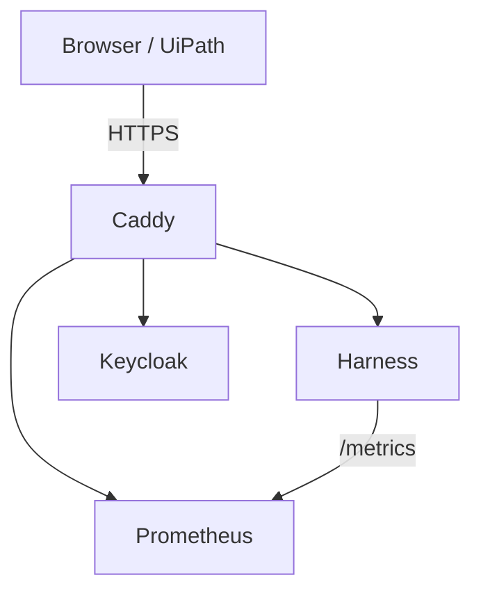

# Architecture

## Overview

The platform consists of independent services composed through a local environment layer.



The architecture follows a service-oriented adapter pattern.

## Service responsibilities

### Harness

Owns:

* enterprise application mimics
* URL contracts
* route resolution
* variants
* page rendering
* synthetic data
* metrics generation (exposes /metrics)

Does not own:

* OAuth/OIDC implementation
* authentication state management
* metrics storage

---

### Keycloak

Owns:

* login flow
* OAuth/OIDC endpoints
* tokens
* claims
* roles
* session behavior
* expiry behavior

Does not own:

* enterprise application behavior

Operated as:

* Docker container, dev mode
* pre-configured realm imported from `infra/keycloak/harness-realm.json`

---

### Prometheus

Owns:

* metric scraping
* metric storage (local)
* metric querying

Does not own:

* metric generation logic

Operated as:

* Docker container
* scrapes Harness `/metrics` endpoint
* config generated from `harness.yaml`

---

### Caddy

Owns:

* host routing
* environment routing
* request headers
* HTTPS configuration
* service composition

Does not own:

* application behavior

---

### CLI

The project exposes two CLI entry points:

**Developer CLI** (`src/cli/`):

* initialization
* validation
* config generation
* data seeding
* realm export/import
* platform start/stop

**Server CLI** (`src/harness/`):

* starts the Harness web server
* loads config and extensions at startup

Neither CLI depends on the other. Both depend on Core.

## Package structure

```text
testharness-webapps/

src/
    core/
    harness/
    cli/

services/
    harness/

infra/
    caddy/
    keycloak/
        harness-realm.json
    prometheus/
        prometheus.yml
    docker-compose.yml

config/
    harness.yaml
```

## Dependency rules

Core is the foundation. All other components depend on Core. No component depends on another service.

```text
          Core
         / | \ \
        /  |  \ \
  Harness CLI CLI Caddy
          dev srv
```

Allowed:

```text
Core → Harness
Core → CLI (developer)
Core → CLI (server)
Core → Caddy
```

Forbidden:

```text
Harness → CLI
CLI → Harness
CLI → Caddy
Core → Keycloak
Core → Prometheus
```

## Extension model

Adding a new enterprise application should require only:

```text
extensions/<app>/
templates/<app>/
data/<app>/
config/harness.yaml  (add app entry)
```

No changes to core behavior should be required.

## Runtime behavior

Request flow:

1. Browser sends request
2. Caddy resolves host and environment
3. Request routed to Harness
4. Variant information injected
5. Harness processes request
6. Metrics recorded to /metrics endpoint
7. Prometheus scrapes metrics
8. Response returned

## Ports

```text
harness     8000
keycloak    8080
prometheus  9090
caddy       80 / 443
```

## Architectural principles

### Core owns contracts

Core defines system behavior.

### Extensions implement contracts

Enterprise mimics provide implementations.

### Adapters consume contracts

CLI, Harness, and future protocols interact through Core contracts.

### Services remain isolated

Services communicate through explicit interfaces only.
